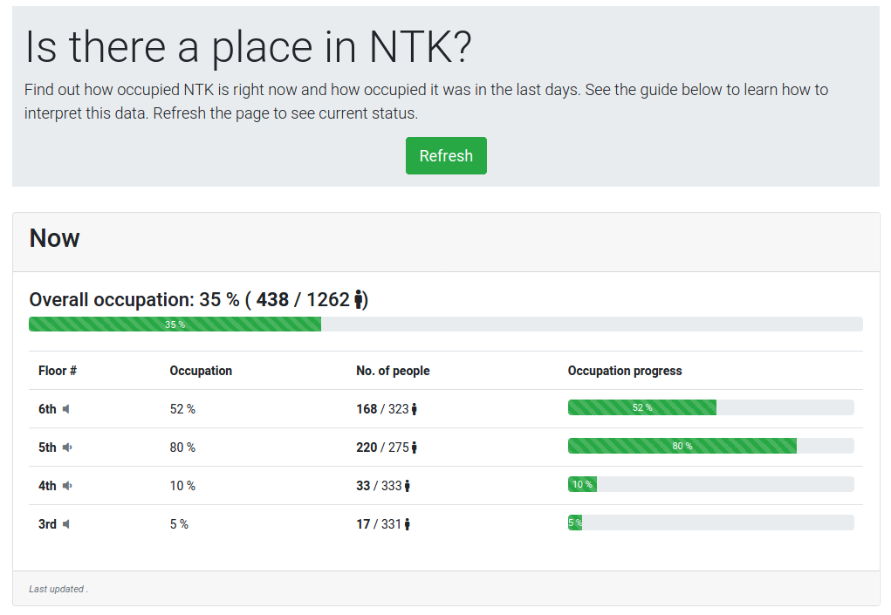

# Occupy NTK

This app periodically scrapes the website of NTK (https://www.techlib.cz/en/) for data about how occupied it is by visitors. It offers more insight by combining this data with information about NTK and by providing graphs of historical occupancy.



Project status: development

## Installation
The app is written in Flask. To install it, you need the package manager [pip](https://pip.pypa.io/en/stable/) (it is recommended to use virtual-env for your local deployment). Use pip to install the dependencies as:

```bash
pip install -r requirements.txt
```
The app can then be deployed by calling Flask:

```bash
flask run
```

The app should then deployed to local server.

## Setting up

Make sure to turn the debugging mode off if you want to see the scraper from **\_\_init\_\_.py** work (debugging mode causes [double](https://stackoverflow.com/questions/25504149/why-does-running-the-flask-dev-server-run-itself-twice) scraping). Debugging mode can be turned of by writing

```bash
export FLASK_DEBUG=1 
```
to the Flask console. The scraper also has to be uncommented, as well as the **add\_dummy\_data()** should be commented out, if you want to see the scraper work.

If you are using virtual env, run it by using:

```bash
source venv_ntk/bin/activate
```

## Running tests
In order to run the unit test, **cd** into the parent directory and run pytest from terminal:

```bash
pytest
```

In order to see coverage of the tests, use:

```bash
coverage run -m pytest
```

To see the results, run:

```bash
coverage report
```

More concise form can be seen in the html format, excluding all the imports:

```bash
coverage html --omit="*/lib*"
```

## Notes

The app doesn't utilize Flask-Bootstrap, since it at this time provides only support for version 3. Bootstrap is imported via CDN.

## Support
If you need help, let me know at vaclavmaixnerj@gmail.com.

## License
[MIT](https://choosealicense.com/licenses/mit/)
